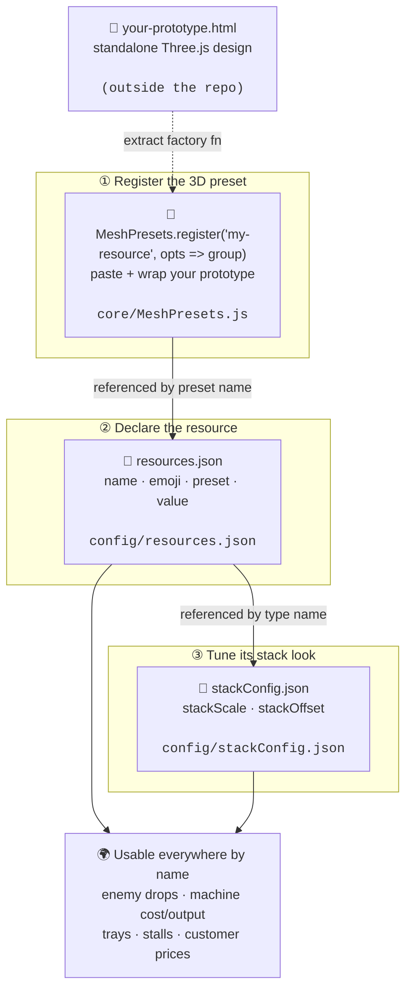

# Adding a New Resource

Integrating a new resource into the game — whether invented from scratch
or ported from a standalone Three.js HTML prototype — touches **three
files**. No system code changes, no imports to wire up. Once the name
is registered, every subsystem (drops, machines, trays, stalls) picks
it up automatically by string lookup.

## The rule

> **Three files, in order: MeshPresets → resources.json → stackConfig.json.**
> Never hard-code a mesh inside a system, and never add a resource-aware
> `if` branch anywhere. If a new subsystem needs the mesh, it must go
> through `ResourceRegistry.createMesh(type)` — not a bespoke factory.

## Flow



## File map (only the files you'll actually edit)

| Step | What it does | File |
|---|---|---|
| ① | **3D mesh factory** — registers a preset callable by name | `src/core/MeshPresets.js` |
| ② | **Resource declaration** — name, emoji, mesh preset, value | `src/config/resources.json` |
| ③ | **Stack tuning** — per-resource scale and vertical offset | `src/config/stackConfig.json` |

## How to integrate a standalone prototype

**Conversion (HTML prototype → preset factory):**
```js
// paste at the bottom of src/core/MeshPresets.js
MeshPresets.register('my-resource', ({ color = 0x66ccff, radius = 0.2 } = {}) => {
    const group = new THREE.Group();
    // ...your prototype's geometry / material / mesh code...
    return group;                 // return — do NOT call scene.add
});
```

**Declare it:**
```json
// src/config/resources.json
"myResource": {
    "emoji": "💎",
    "mesh": { "preset": "my-resource" },
    "value": 2
}
```

**Tune its stack:**
```json
// src/config/stackConfig.json
"myResource": { "stackScale": 0.8, "stackOffset": 0.5 }
```

Use it anywhere by string:
```js
// drops in an enemy archetype
"Drops": { "resources": ["myResource"] }

// machine cost / output
"Machine": { "cost": { "myResource": 5 }, "output": "coin" }
```

## Rules for the preset factory

- **Return** the root `Object3D` (Mesh or Group). Do **not** call `scene.add`.
- **Destructure tunables** with defaults (`color`, `radius`, …) so entries in `resources.json` can override them.
- **No animation in the factory body.** For live motion, attach `onBeforeRender` to the mesh (see `essence-tube` at `core/MeshPresets.js:790` for a live example).
- **Separate ground vs. carried look** if needed — use `meshGround` + `meshStacked` in `resources.json` instead of `mesh` (see `essence` for the canonical example).

## What NOT to do

- ❌ Create the mesh directly in a system with `new THREE.Mesh(...)`.
- ❌ Add a new JSON file just for this resource — extend the two existing ones.
- ❌ Hard-code `mesh.scale` anywhere — `stackConfig.json` is the single source of truth (see `universal-stacking.md`).
- ❌ Register the same preset name twice. Names are a global namespace.
- ❌ Import anything new in `main.js` — `MeshPresets.js` is already loaded at boot, so a `register()` call at the bottom is enough.

If your resource seems to need a 4th file, you're probably inventing a
parallel path. Re-read this flow and route through the three slots instead.
