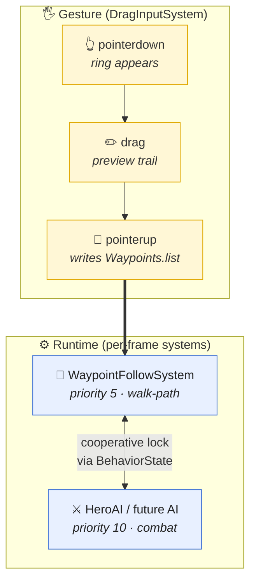

# Drag-to-Waypoint Unit Command

Touch/drag a commandable entity to send it walking in a straight line
to where you release. Character-agnostic — any entity can be made
commandable by adding three JSON blocks.

## The rule

> To make any character (player, hero, NPC, future unit) drag-commandable,
> add the three JSON blocks shown under **How to use** to its archetype.
> Do NOT write a parallel selection/input layer — reuse
> `DragInputSystem` + `WaypointFollowSystem`.

## Flow



**Files**: gesture → [DragInputSystem.js](../../src/systems/DragInputSystem.js) + [Component_Waypoints.js](../../src/ecs/components/Component_Waypoints.js) · runtime → [WaypointFollowSystem.js](../../src/systems/WaypointFollowSystem.js) + [Component_BehaviorState.js](../../src/ecs/components/Component_BehaviorState.js) · example AI → [HeroAISystem.js](../../src/systems/HeroAISystem.js)

## Priority convention (BehaviorState)

| Priority | Tag | Who claims it |
|---|---|---|
| `0`  | `idle`      | default (released by all) |
| `5`  | `walk-path` | `WaypointFollowSystem` |
| `10` | `combat`    | `HeroAISystem` (and any future combat AI) |
| `20+`| `cinematic` | reserved for scripted/cutscene systems |

Lower claims yield automatically when a higher one is set; they
resume when it drops back to ≤ their own priority.

## File map (only files you'll actually edit)

| Element | File |
|---|---|
| 👆 **Pointer input + selection ring + trail** | `src/systems/DragInputSystem.js` |
| 🚶 **Walk the path** | `src/systems/WaypointFollowSystem.js` |
| 🎯 **Path state (per entity)** | `src/ecs/components/Component_Waypoints.js` |
| 🎨 **Drag tag + visual config** | `src/ecs/components/Component_DragCommandable.js` |
| ⚔️ **Priority lock** | `src/ecs/components/Component_BehaviorState.js` |
| 🤖 **Example AI that claims priority 10** | `src/systems/HeroAISystem.js` |
| 📋 **Enable on an entity** | `src/config/archetypes/<name>.json` |

## How to use it

Add these three blocks to any archetype JSON's `components` object —
**no code changes needed**:

```json
"DragCommandable": {
  "enabled": true,
  "ringColor": "0xffd700",
  "trailColor": "0xffd700",
  "pickRadius": 0.9
},
"Waypoints": {
  "onInterruptResume": "destination",
  "arrivalThreshold": 0.25
},
"BehaviorState": { "priority": 0, "tag": "idle" }
```

Movement speed comes from the archetype's existing `Movement.speed`.
`onInterruptResume: "destination"` = resume to endpoint after combat.
`"idle"` option is reserved for future (not yet branched).

### Make a new AI interrupt the walk

In your system's `update()`, claim/release via `BehaviorState`:

```js
const bs = ecs.getComponent(id, 'BehaviorState');
if (shouldAct) {
    if (bs && bs.priority > MY_PRIORITY) return;   // stronger owns
    if (bs && bs.tag !== 'my-tag') {
        bs.priority = MY_PRIORITY; bs.tag = 'my-tag';
    }
    // ...your movement/action writes...
} else if (bs && bs.tag === 'my-tag') {
    bs.priority = 0; bs.tag = 'idle';              // release
}
```

## What NOT to do

- ❌ Add pointer listeners to `document` / `window` for commanding units — use `DragInputSystem`'s canvas listeners.
- ❌ Write to `Movement.controller` or `Movement.targetPoint` to steer a commanded entity — `WaypointFollowSystem` writes `mesh.position` directly, same style as `HeroAISystem`.
- ❌ Keep a `selectedId` somewhere else — selection is **gesture-scoped**. The ring lives only while the finger is down.
- ❌ Assume the hero: `DragInputSystem` and `WaypointFollowSystem` never import anything hero-specific. If you need hero-only behavior, put it in an AI system, not in the input or movement layer.
- ❌ Bypass `BehaviorState` for interrupt/resume. Two systems that both write `mesh.position` without respecting priority will fight.
