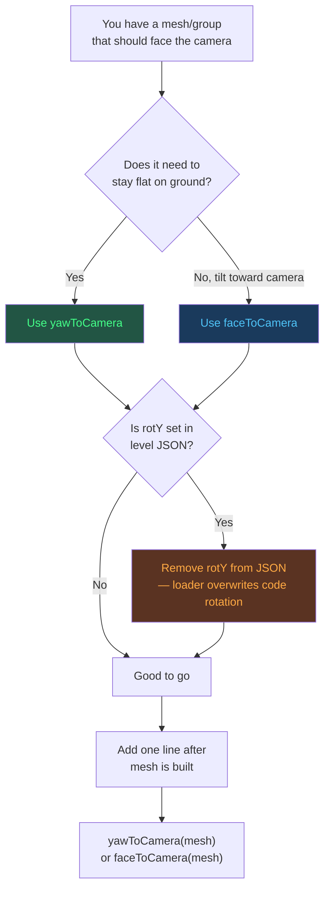
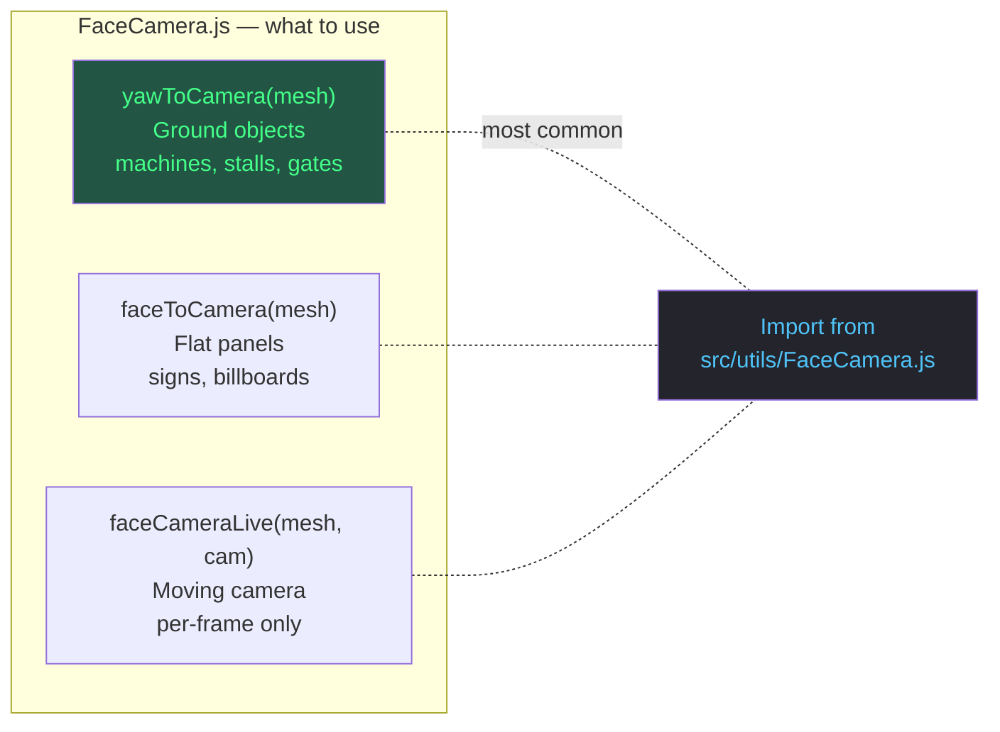

# Face Camera — Logic Flow

How to make any object face the isometric camera.

## Quick Recipe

```js
import { yawToCamera } from '../utils/FaceCamera.js';

// After building your mesh/group:
yawToCamera(mesh);
```

That's it. One import, one line.

## Important Rule

If the object has `"rotY"` in the level JSON, **remove it** — the scene loader applies `rotY` after build and will overwrite `yawToCamera`.

## Decision Flow



## File Map

```
src/utils/FaceCamera.js          <-- Single source of truth
│
├── yawTo(mesh, offset)           Raw Y-axis rotation (manual offset)
├── faceTo(mesh, offset)          Yaw + pitch (manual offset)
├── pitchTo(mesh, offset)         Pitch only (manual offset)
├── faceCameraLive(mesh, camera)  Per-frame tracking (moving cameras)
│
├── yawToCamera(mesh)             Auto-reads CAMERA_CONFIG — USE THIS
└── faceToCamera(mesh)            Auto-reads CAMERA_CONFIG + pitch
```

```
src/utils/Billboard3D.js          <-- Re-exports from FaceCamera.js
                                       (backward compat only, use FaceCamera.js for new code)
```

```
src/config/gameConfig.js
└── CAMERA_CONFIG.offset = { x:12, y:20, z:12 }   <-- The isometric angle
```

## Function Cheat Sheet



## Lessons Learned

| Mistake | Why it failed | Avoid by |
|---|---|---|
| `faceCameraLive` on root | Tilts mesh off ground (applies pitch) | Use `yawToCamera` for ground objects |
| Per-frame `yawTo` tracking camera position | Machine rotates when player moves | Use one-time `yawToCamera` at build |
| `yawToCamera` with `rotY` in JSON | Loader overwrites rotation.y after build | Remove `rotY` from JSON |
| Applied to child only (e.g. gears) | Rest of machine didn't rotate | Apply to the root group |
