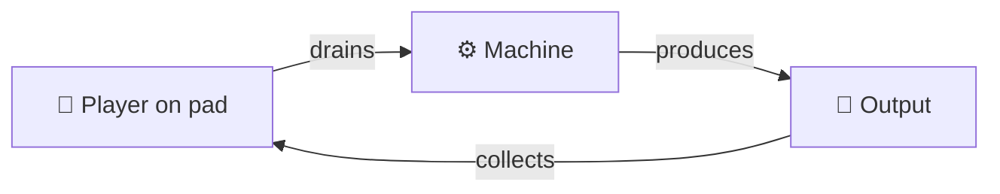
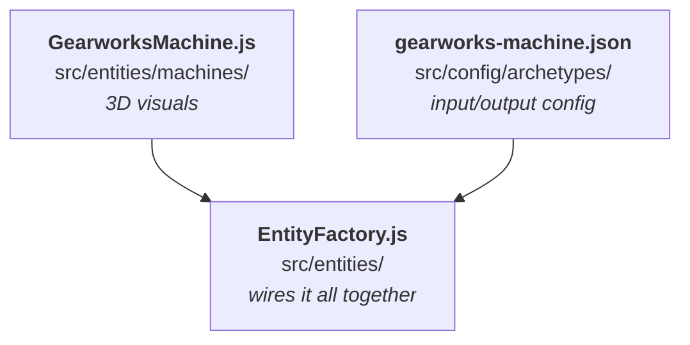

# Gearworks Machine

```mermaid
graph LR
    A["🧍 Player on pad"] -->|drains| B["⚙ Machine"]
    B -->|produces| C["🍬 Output"]
    C -->|collects| A
```

## Key Files

```mermaid
graph TD
    A["<b>GearworksMachine.js</b><br/>src/entities/machines/<br/><i>3D visuals</i>"]
    B["<b>gearworks-machine.json</b><br/>src/config/archetypes/<br/><i>input/output config</i>"]
    C["<b>EntityFactory.js</b><br/>src/entities/<br/><i>wires it all together</i>"]

    A --> C
    B --> C
```
