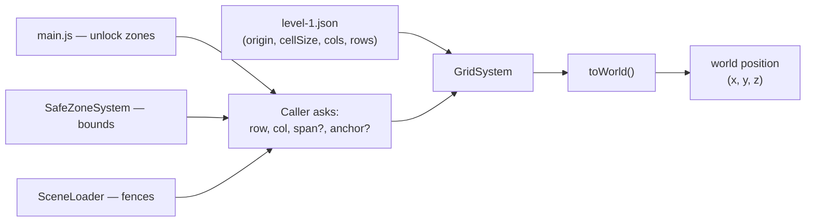
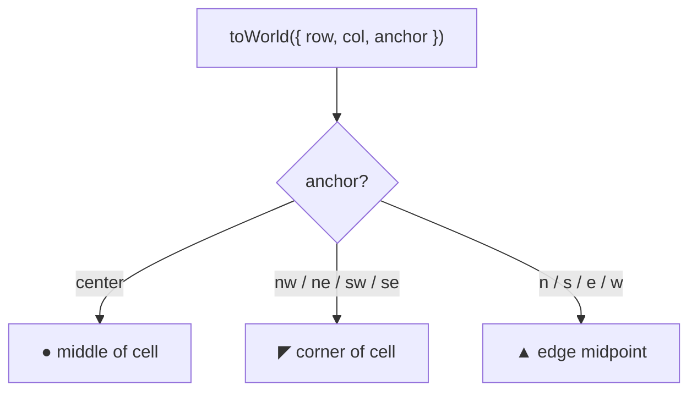

# Grid System — Logic Flow

One function. Every grid→world lookup goes through it.

## Anchor options

## One-line mental model

> "Give me a grid cell, I give you a world point — you pick where in the cell."

## Where the logic lives

| What | File | Notes |
|---|---|---|
| **The function** | `src/core/GridSystem.js` | `toWorld({ row, col, span?, anchor?, offset?, y? })` and `toWorldBounds(...)`. Single source of truth. |
| **Grid config** | `src/config/levels/level-1.json` → `"grid"` | `origin`, `cellSize`, `cols`, `rows`. Expand the grid by editing here. |
| **Instantiation** | `src/core/SceneLoader.js` | `new GridSystem(levelData.grid)` — runs once per level load. |
| **Callers** | `src/main.js` (unlock zones, machines), `src/systems/SafeZoneSystem.js` (bounds), `src/core/SceneLoader.js` (fences) | All route through `grid.toWorld(...)`. No file rolls its own. |
| **Tool emitters** | `tools/machine/builder.html`, `tools/unlock-zone/builder.js` | Emit grid-native JSON (`cell`, `anchor`, `offset`) — loader resolves to XYZ. |

## Prompting Claude Code next time

Paste any of these and Claude will route to this system:

- *"Use the GridSystem — see `design/logic-flow/grid-system.md`."*
- *"Place this at cell `[row, col]` with anchor `nw` (via `GridSystem.toWorld`)."*
- *"Don't hand-roll `origin + col * cellSize` — go through `src/core/GridSystem.js`."*

Rule of thumb: if a file computes a world position from a row/col, it MUST import `GridSystem` or receive a `grid` reference and call `grid.toWorld(...)`.
