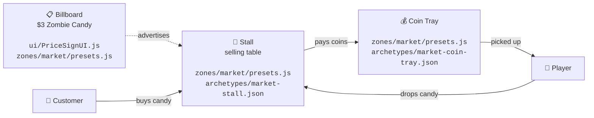

# Market Stall — Selling Loop

How the Stall, Billboard, and Coin Tray work together, and where each
one lives in the code.

**File map (only the files you'll actually edit)**

| Element | Visual / 3D shape | Data / config |
|---|---|---|
| 🏪 **Stall** | `src/zones/market/presets.js` | `src/config/archetypes/market-stall.json` |
| 📋 **Billboard** | `src/zones/market/presets.js` | `src/ui/PriceSignUI.js` *(text + font)* |
| 💰 **Coin Tray** | `src/zones/market/presets.js` | `src/config/archetypes/market-coin-tray.json` |

**In plain words:**
1. The **Billboard** shows what the **Stall** is selling.
2. The **Player** drops candy on the Stall.
3. **Customers** walk by, buy candy, and drop coins in the **Coin Tray**.
4. The **Player** collects the coins from the Tray.
