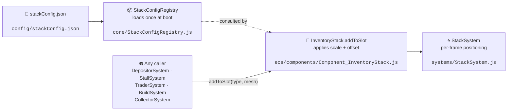

# Universal Stacking System

Everything that piles up visually in this game — candies on the player's
back, coins on a tray, output on the gearworks machine, product on a
market stall — goes through the **same** three files. Do not invent a
new stacking path; route through these.

## The rule

> **Never set `mesh.scale` or pick a stack offset in your own system.**
> Call `inventory.addToSlot(resourceType, mesh)` — it reads the config
> and applies scale + offset for you. One place to tune every stack
> in the game: `src/config/stackConfig.json`.

## Flow



## File map (only the files you'll actually edit)

| Element | File |
|---|---|
| 🎛 **Per-resource scale + offset** (tunable) | `src/config/stackConfig.json` |
| 📦 **Config loader** (singleton, boot-time) | `src/core/StackConfigRegistry.js` |
| 🎯 **Universal add-to-stack entry point** | `src/ecs/components/Component_InventoryStack.js` |
| 🌀 **Per-frame stack positioning** | `src/systems/StackSystem.js` |

## How to reuse it in new code

**Adding items to any stack (the ONLY supported way):**
```js
const inv = ecs.getComponent(entityId, 'InventoryStack');
inv.addToSlot(resourceType, mesh); // scale + offset applied automatically
```

**Tuning how a resource stacks** (e.g., bigger candy, tighter coins):
edit `src/config/stackConfig.json` — every stack in the game updates.

**Making an entity stackable**: give it an `InventoryStack` component in
its archetype JSON (`src/config/archetypes/<name>.json`). Done — the
StackSystem picks it up automatically by query.

## What NOT to do

- ❌ Call `mesh.scale.setScalar(...)` in a system before adding to inventory.
- ❌ Store a custom `stackOffset` inside a new component.
- ❌ Fetch `stackConfig.json` in a new system (`StackConfigRegistry` already did that at boot).
- ❌ Write a parallel stacking utility "just for this feature".

If your use case seems not to fit, update `Component_InventoryStack` or
`stackConfig.json` — do not fork the pattern.
